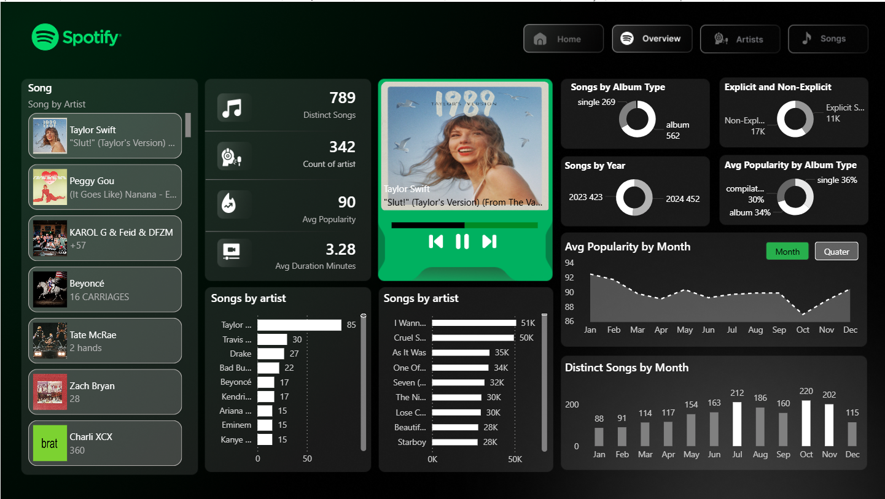

# 🎵 Spotify Top 50 World — Analytics Dashboard | Power BI


> A fully interactive Power BI dashboard analyzing the Spotify Global Top 50, built with 30+ custom DAX measures.

---

## 📸 Dashboard Preview



---

## 📌 Project Overview

This project analyzes the **Spotify Global Top 50** chart data and presents it as a single-page, interactive Power BI dashboard. From chart positions and popularity scores to album types and explicit content breakdown — every angle of the data is covered with custom DAX and a polished Spotify-inspired design.

**Highlights:**
- 🎧 Spotify-style music player card with dynamic album artwork
- 📊 30+ custom DAX measures across songs, artists, albums & time
- 🔀 Month / Quarter toggle for trend analysis
- 🖼️ Album art that updates dynamically on song selection

---

## 📂 Dataset — `Top-50-world`

| Column | Description |
|---|---|
| `song` | Track name |
| `artist` | Artist name |
| `position` | Chart position (1–50) |
| `popularity` | Spotify popularity score (0–100) |
| `duration_ms` | Track duration in milliseconds |
| `is_explicit` | Boolean — explicit content flag |
| `album_type` | single, album, or compilation |
| `total_tracks` | Number of tracks in the album |
| `album_url` | Spotify URL — used for cover artwork |

---

## 🧮 DAX Measures — Full Reference

### Songs & Artists
| Measure | Description |
|---|---|
| `Total Songs` | Total rows in dataset |
| `Distinct Songs` | Unique song count |
| `Distinct Artists` | Unique artist count |

### Popularity
| Measure | Description |
|---|---|
| `Avg Popularity` | Average popularity score |
| `Max Popularity` | Highest popularity score |
| `Min Popularity` | Lowest popularity score |

### Duration
| Measure | Description |
|---|---|
| `Avg Duration Minutes` | Average track length in minutes |
| `Max Duration Minutes` | Longest track |
| `Min Duration Minutes` | Shortest track |

### Explicit Content
| Measure | Description |
|---|---|
| `Explicit Songs` | Count of explicit tracks |
| `Non-Explicit Songs` | Count of clean tracks |
| `Pct Explicit Songs` | % of explicit tracks |
| `Avg Popularity Explicit` | Avg popularity for explicit songs |
| `Avg Popularity NonExplicit` | Avg popularity for clean songs |

### Chart Position
| Measure | Description |
|---|---|
| `Avg Position` | Average chart position |
| `Position 1 Songs` | Songs that hit #1 |
| `Position 1 Artists` | Artists that hit #1 |

### Album
| Measure | Description |
|---|---|
| `Avg Tracks per Album` | Average album size |
| `Album Type Count` | Distinct album types |
| `Singles Count` | Songs from singles |
| `Albums Count` | Songs from albums |

### Artist-Scoped
| Measure | Description |
|---|---|
| `Songs per Artist` | Total entries per artist |
| `Distinct Songs per Artist` | Unique songs per artist |
| `Avg Popularity per Artist` | Avg popularity per artist |
| `Position1 Hits per Artist` | #1 hits per artist |

### Time-Scoped
| Measure | Description |
|---|---|
| `Songs per Year` | Entries per year |
| `Avg Popularity per Year` | Avg popularity per year |
| `Avg Duration per Year` | Avg duration per year |
| `Pct Explicit per Year` | % explicit per year |

---

## 🎨 Design System

| Element | Value |
|---|---|
| Background | `#0D1B0F` |
| Accent | `#1DB954` — Spotify Green |
| Text Primary | `#FFFFFF` |
| Text Secondary | `#AAAAAA` |

Designed in **Figma** → exported as PNG → imported into Power BI as wallpaper.

---

## 🛠️ Tools Used

| Tool | Purpose |
|---|---|
| Power BI Desktop | Dashboard & data modeling |
| DAX | 30+ custom measures & columns |

---

## 🚀 Getting Started

1. Clone the repo
2. Open `Spotify_Dashboard.pbix` in Power BI Desktop
3. `Home → Transform Data → Data Source Settings` → point to your local CSV
4. `Format Page → Wallpaper → Image` → select `assets/backgrounds/Background.png`

---

## 📁 Folder Structure
```
spotify-powerbi-dashboard/
├── Spotify.pbix
├── README.md
├── dataset/
│   └── spotify-top-50-world.csv
├── Dax/
│   └── measures.dax
└── asset/
    ├── dashboard_overview.png
    └── Background and icons/
        ├── Background.png
        └── Icons/
```

---

## 💡 Key Insights

### 🎤 Artist Dominance
- **Taylor Swift** leads the chart with **85 song entries** — more than double any other artist, showing unmatched consistency on the Global Top 50
- A small group of **5–6 artists** account for the majority of chart appearances, revealing how concentrated streaming success really is

### 🔥 Popularity Trends
- The **average popularity score sits at 90**, meaning the Top 50 is extremely competitive — only the most-streamed tracks globally make it in
- Popularity dips slightly mid-year (June–August) and **peaks around September–November**, suggesting end-of-year releases drive major engagement

### 🎵 Singles vs Albums
- **Singles dominate** the chart — the majority of Top 50 entries come from single releases rather than full albums, confirming that artists strategically drop standalone tracks for maximum chart impact
- Albums that do chart tend to have higher total track counts, suggesting fan deep-dives into full projects

### 🤬 Explicit vs Clean
- Explicit songs make up a significant portion of the chart (**~11K explicit vs 17K non-explicit**), showing mainstream audiences are comfortable with explicit content
- Interestingly, **non-explicit songs maintain a comparable popularity score**, meaning clean tracks are just as competitive on the charts

### 📅 Year-over-Year
- **2024 slightly outpaces 2023** in song entries (452 vs 423), suggesting the pace of chart turnover is accelerating — songs are rising and falling faster
- Duration has stayed relatively stable year-over-year, hovering around **3.2–3.3 minutes** — short, punchy tracks remain the format of choice

### 🏆 Position #1
- Reaching **position #1** is rare and concentrated among very few artists, with most artists appearing across positions 2–50
- The artists with the most #1 hits also tend to have the highest average popularity scores overall

---

## 📝 Conclusion

This dashboard demonstrates how raw streaming data can be transformed into a compelling, story-driven analytics experience. By combining **30+ custom DAX measures** with a **Spotify-inspired UI built in Figma**, the project goes beyond standard reporting to deliver something that feels like a real product.

The data tells a clear story: the Global Top 50 is dominated by a handful of powerhouse artists, singles are the weapon of choice for chart success, and audience engagement peaks toward the end of the year. These are the kinds of insights that labels, artists, and marketers can act on.

From a technical standpoint, this project showcases end-to-end Power BI development — from raw CSV ingestion and data modeling to advanced DAX, dynamic filtering, image-based slicers, and polished visual design. Every element was intentionally built to balance aesthetics with analytical depth.

> *"Good data visualization doesn't just show numbers — it tells the story behind them."*

---

## 👨‍💻 Author

**Hariom Dixit**
📍 Mumbai, India

---

*If this project helped you or gave you ideas, please give it a ⭐ on GitHub — it means a lot!*
